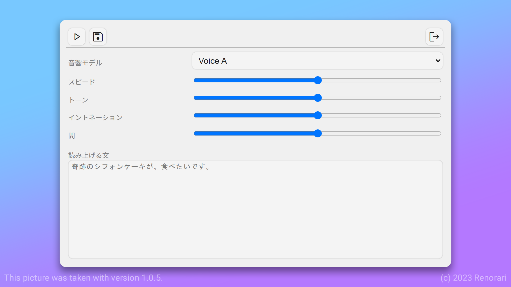

# Kana-Voice-Tool




れのらりによって作成された、KanaVoiceのデスクトップ向け音声合成ソフトウエア

## インストール

リリースページからインストーラーをダウンロードし、インストールしてください。

## 実行

インストール後、デスクトップにショートカットが作成されます。

## ビルド

```bash
npm run make
```

## テスト

```bash
npm start
```

## ライセンス

GNU GENERAL PUBLIC LICENSE
Version 3, 29 June 2007

## 作者

[Renorari](https://github.com/renorari)